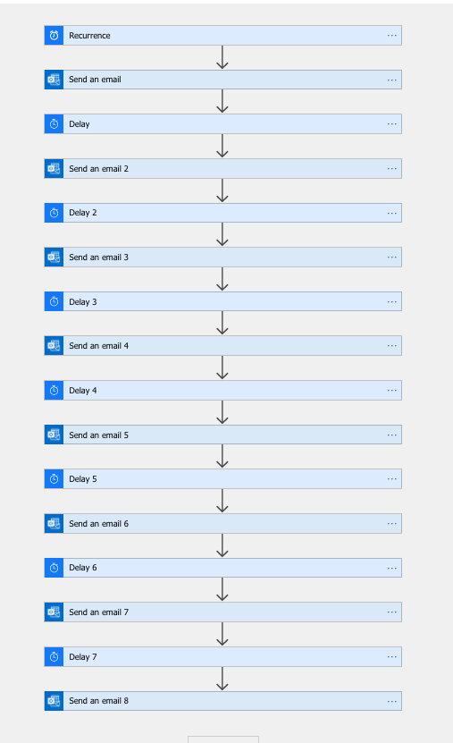

# Challenge 2: TASK SCHEDULER

[Source](https://25daysofserverless.com/calendar/2)

Create a task scheduler that will tell Lucy exactly when she should relight candles, pour coffee into cups, and deliver batches of coffee.

I used Azure Logic apps for this.

[Solution](https://github.com/madebygps/25-days-of-serverless-2019/blob/master/day_02/day02_logicapp_template.json)

