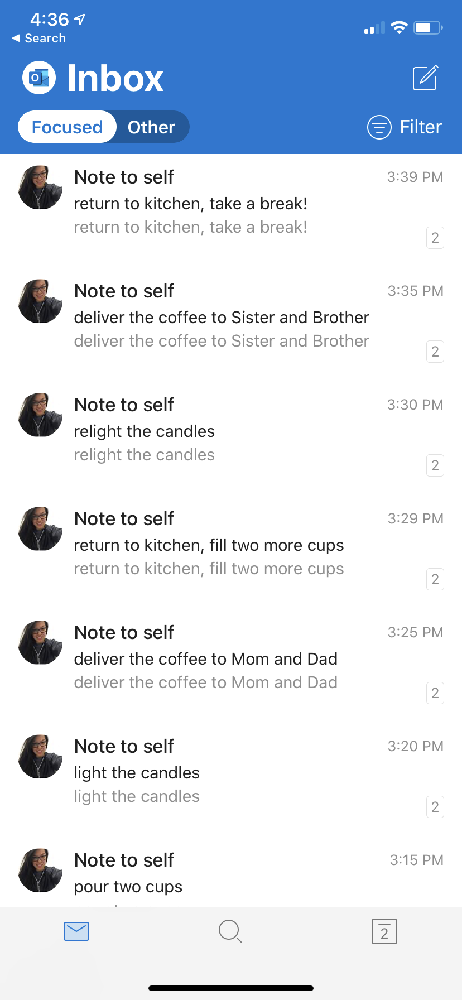

# Challenge 2: TASK SCHEDULER

[Description of challenge](https://25daysofserverless.com/calendar/2)

Create a task scheduler that will tell Lucy exactly when she should relight candles, pour coffee into cups, and deliver batches of coffee.

[Solution](https://github.com/madebygps/25-days-of-serverless-2019/blob/master/day_02/day_02_logicapp_template.json)

I used Azure Logic apps for this. This is what the workflow looks like. 

Once it is manually triggered, it will use a  delay to give Lucy enough time for the task, then alert her via email for the next task.

