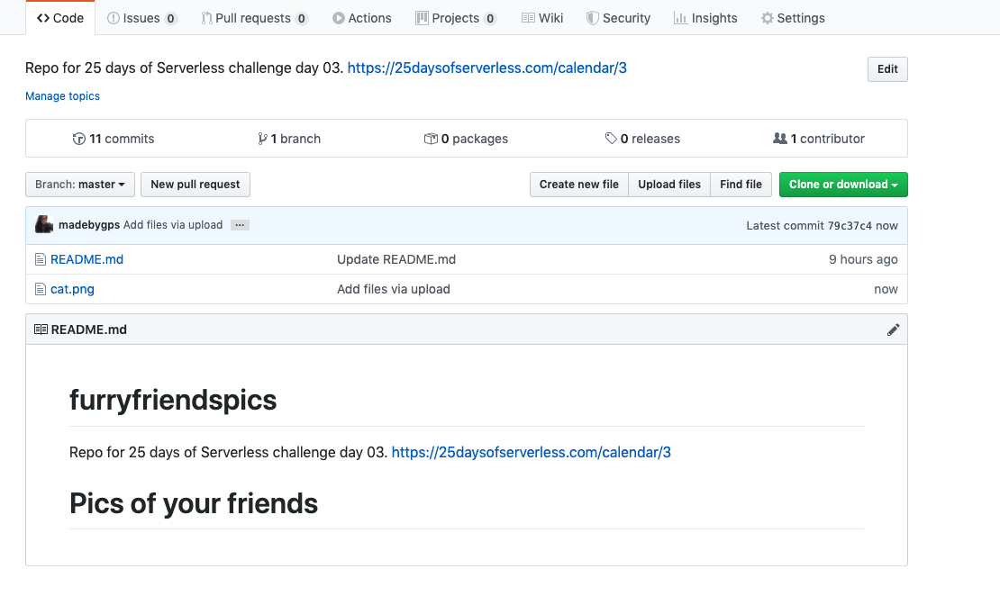
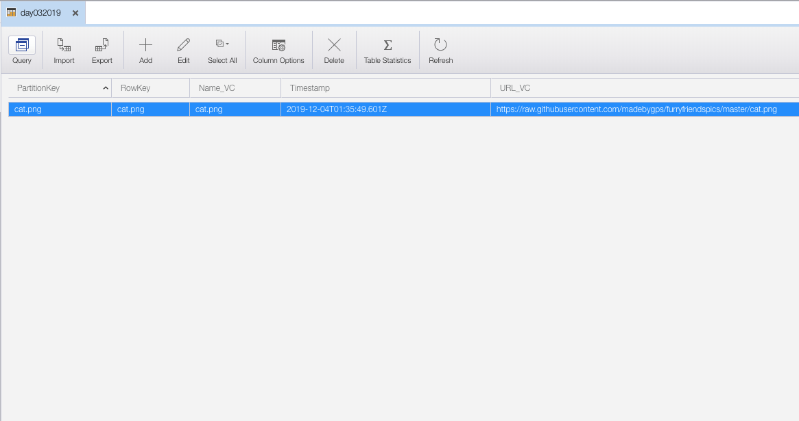

# Challenge 3: Webhooks

[Description of challenge](https://25daysofserverless.com/calendar/3)

For this challenge, create a web service that gets called every time a commit or push is made to a Github repository. If the commit has a file ending with .png, your service should take the URL to the image from Github and store it in whatever database you like.

## Solution 

Commit your pngs to 🐈🐕🐇[this repo](https://github.com/madebygps/furryfriendspics)

I used an Azure function to listen to web hook,if commit contains file with .png, save url of file to Azure Table storage.

