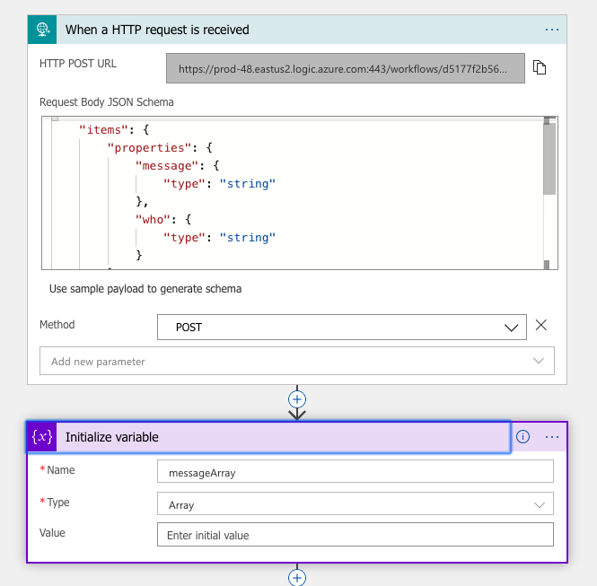
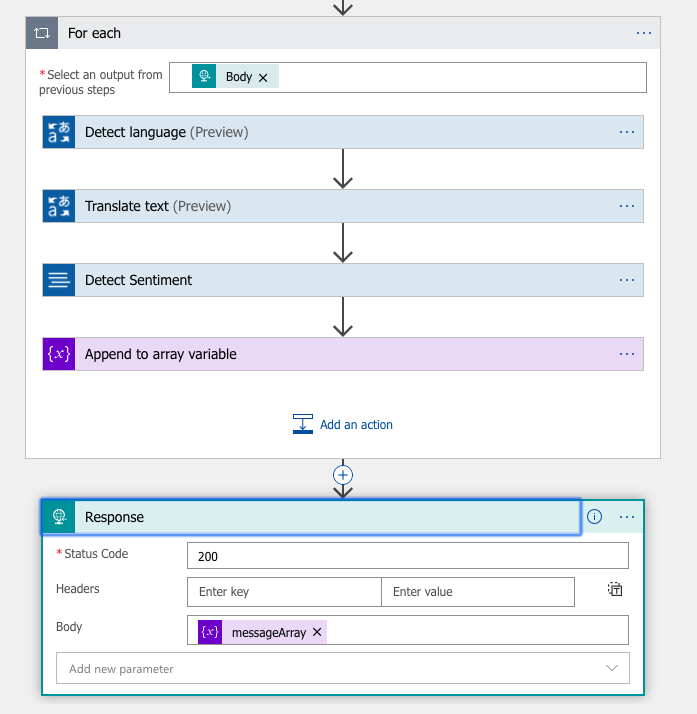
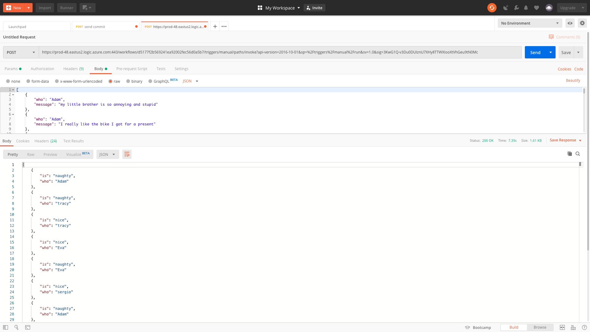

# Challenge 5: Smart Apps

[Description of challenge](https://25daysofserverless.com/calendar/5)


Write a serverless application that helps Santa figure out if a given child is being naughty or nice based on what they've said. You'll likely need to detect the language of the correspondence, translate it, and then perform sentiment analysis to determine whether it's naughty or nice.

## Solution 

I created an Azure Logic App that uses Microsoft translator and text analysis API.

Send JSON in this format.

```json
{
    "who": "Name",
    "message": "your message"
}
```
to

https://prod-48.eastus2.logic.azure.com:443/workflows/d5177f2b569241ea92002fec56d0a5b7/triggers/manual/paths/invoke?api-version=2016-10-01&sp=%2Ftriggers%2Fmanual%2Frun&sv=1.0&sig=3KwG1Q-v3Du0DUIznU7XHy8TTWXIooXtVhGeu9tN0Mc

Here is the workflow designer. 




## Results


