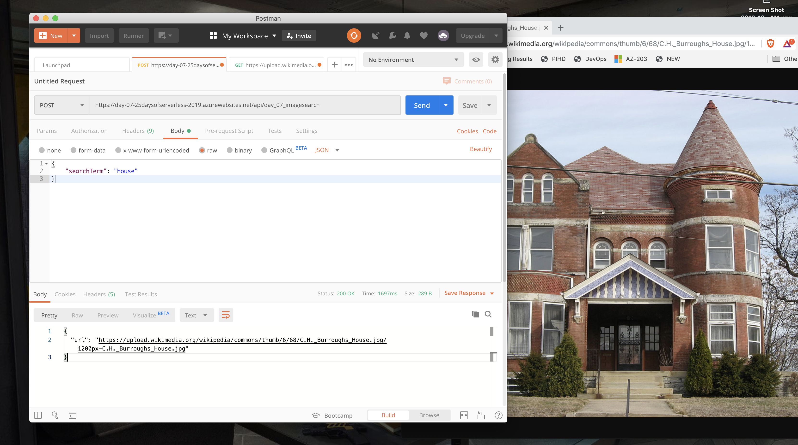

# Challenge 7: API EndPoint - Picture Challenge

[Description of challenge](https://25daysofserverless.com/calendar/7)

Let's help Miguel by building a web API that lets his neighbors search for images of things they want to get rid of. Build an application (e.g. a cloud function with a single endpoint) that takes text as an input and returns an image found on unsplash or another image platform.

## Solution 

I created a few Azure Functions where you can submit a searchTerm and an image url is returned. The function uses the [Bing Image Search SDK for C#](https://docs.microsoft.com/en-us/azure/cognitive-services/bing-image-search/image-search-sdk-quickstart) and [Azure keyvault](https://docs.microsoft.com/en-us/azure/app-service/app-service-key-vault-references) for added security.


### Search for image

To search for an image, send json to https://day-07-25daysofserverless-2019.azurewebsites.net/api/day_07_imagesearch/ formatted in this way
```json
{
    "searchTerm":"image search term"
} 
```


