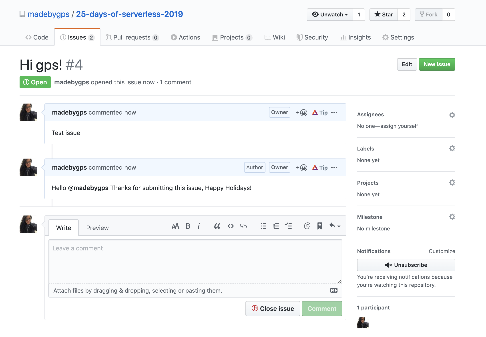

# Challenge 9: Durable functions

[Description of challenge](https://25daysofserverless.com/calendar/9)

We challenge you to automate creating a holiday themed "thank you" with serverless that replies to all issues created in one or more of your GitHub repositories

## Solution

I used Azure functions .net, [OktokitNet](https://octokitnet.readthedocs.io/en/latest/) and Azure Keyvaults to create a serverless response for a github issue [created at this repo](github.com/madebygps/25-days-of-serverless)

